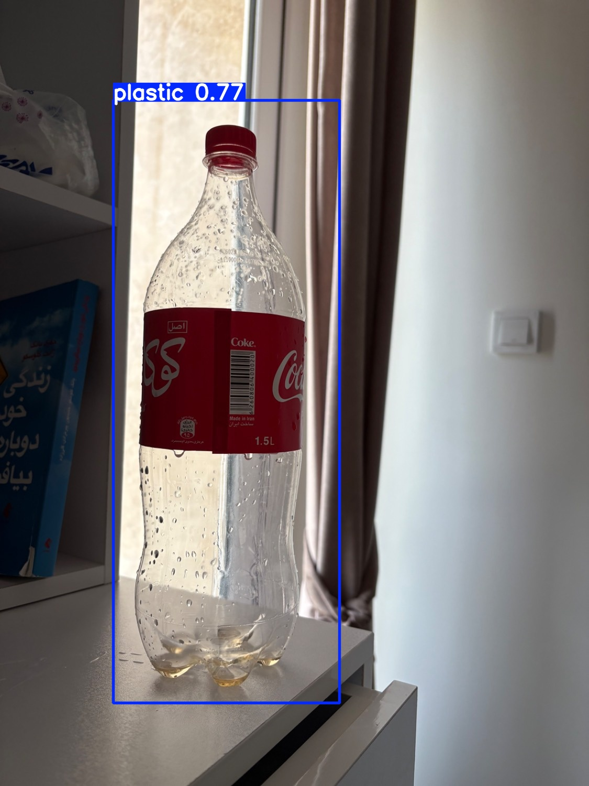

♻️ Waste Detection using YOLOv8

A deep learning project for real-time waste classification (Plastic, Metal, Paper) using **YOLOv8** and transfer learning. 

This project covers the full AI lifecycle: from **manual data annotation** to **model training** and **inference**.

---

## 🖼️ Detection Samples
 and (samples/test_video.avi)

---

## 🚀 Key Features
- **Custom Dataset:** Manually annotated using **LabelImg**.
- **Modern Architecture:** Built on Ultralytics YOLOv8.
- **Optimized Training:** Trained on **NVIDIA RTX 4060 GPU** with custom augmentations.
- **Inference Pipeline:** Supports both image and video processing.

---

## 🏷️ Dataset & Annotation
The dataset consists of waste items categorized into three classes:
1. `plastic`
2. `metal`
3. `paper`

**Annotation Details:**
- **Tool:** LabelImg
- **Format:** YOLO (Normalized coordinates)
- **Samples:** Check the `sample_data/` directory for a glimpse of the training/validation labels and images.

---

## 🛠️ Project Structure
```text
waste-detection/
├── sample_data/      # Samples of images & labels for demonstration
├── samples/          # Inference results (Images/Videos)
├── dataset/          # Dataset configuration (data.yaml)
├── train.py          # Script for model training
├── predict.py        # Script for running inference
└── requirements.txt  # Project dependencies

🔍 Getting Started
1. Installation
bash
python -m venv venv
source venv/Scripts/activate  # On Windows
pip install -r requirements.txt
2. Running Inference
To test the model on an image:

bash
python predict.py --source "path/to/image.jpg" --save --show
To test on a video:
bash
python predict.py --source "path/to/video.mp4" --save --show --stream

📦 Requirements
ultralytics
torch (CUDA recommended for training)
opencv-python
numpy

🎯 Future Roadmap (Healthcare AI)
This project serves as a technical foundation for specialized Healthcare AI applications, such as:
